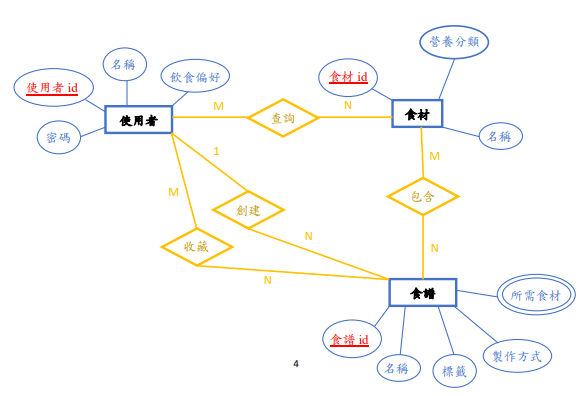
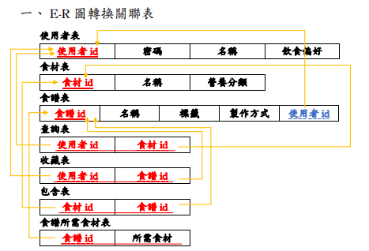
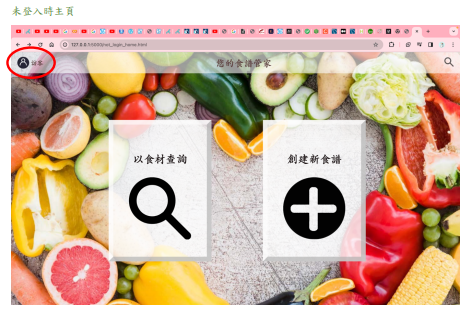
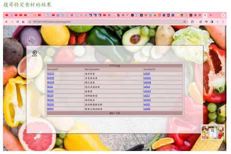
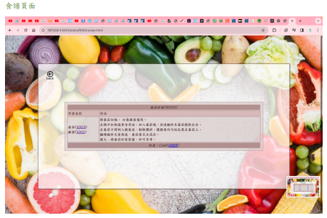

# Recipe-Recommendation-System
運用 Node.js 與 MySQL 開發的智慧食譜推薦系統，具備符合 BCNF 正規化標準的資料庫架構與會員管理機制

### 概念呈現影片

## Overview
透過我們所建立之查詢系統及資料庫解決使用者運用食材上的困難，將冰箱中的食材組合成一道完美的佳餚，並給予使用者食譜教予製作過程。
**開發流程**：系統需求分析 ➔ E-R圖邏輯設計 ➔ 關聯表轉換與正規化 ➔ 實體建置 (MySQL) ➔ 系統測試與整合。

### 開發階段核心技術對應檔案
1. **基礎前端介面建置**：實作登入、註冊、查詢與創建介面 ➔ `static/`
2. **後端伺服器設定**：處理前端路由與請求 ➔ `main.py`
3. **資料庫邏輯與模型設計**：正規化關聯表模型 ➔ `database.mwb`
4. **專題成果與報告**：完整書面說明與提報簡報 ➔ `Final_Report.pdf`, `Presentation_Slides.pptx`

---

## 專題簡介
發現許多人會看著冰箱裡滿滿當當的食材卻不知道從何下手，希望可以開發一系統來解決此日常生活中常見的難題。
本專題不只建立單一的前端網頁，而是從資料庫正規化的基礎出發，依序完成 E-R 圖設計、關聯表轉換，最後透過實體建置與前端介面整合，打造一套結構嚴謹的智慧食譜管家。

## 系統目標與需求
* 使用者可註冊登錄系統，帳號不可重複。
* 使用者登錄後可記錄自己的飲食偏好(Ex.葷素)，並設定自己的名稱，日後可更改。
* 建立完整的食材分類(穀物類、水果類、蔬菜類、豆魚蛋肉類、乳品類、油脂與堅果種子類)。
* 使用者可建立食譜與他人分享，亦可收藏他人的食譜。
* 使用者可利用食材查詢食譜，系統需展示食譜製作方式、所需食材與葷素標籤。

## 資料庫邏輯設計
為了妥善管理使用者、食材與食譜之間的複雜關聯，本系統進行了嚴謹的邏輯設計：
* **核心實體**：使用者 (包含密碼、名稱、飲食偏好)、食材 (包含名稱、營養分類)、食譜 (包含名稱、標籤、製作方式)。
*(下圖：專案之 E-R 關聯圖)*
 

* **關聯性設計**：設計了查詢、收藏、包含與創建等多對多或一對多的關聯邏輯。
*(下圖：E-R 圖轉換為實體關聯表)*

## 方法

### 1. E-R 圖轉換關聯表
為確保資料結構完整，我們將 E-R 圖明確轉換為以下關聯表：
* `使用者表`、`食材表`、`食譜表`。
* `查詢表`、`收藏表`、`包含表`、`食譜所需食材表`。

### 2. 資料庫正規化 (Normalization)
針對轉換後的關聯表，進行了嚴格的正規化檢驗與修正：
* **1NF (第一正規化)**：針對食譜表中「所需食材」可能不只一種的多值屬性，將其拆分成多筆資料（如將奶油、玉米、洋蔥拆解為獨立資料列）以符合 1NF 標準。
* **2NF (第二正規化)**：確保所有非鍵值屬性皆完成功能相依於主鍵。
* **3NF (第三正規化)**：確認非鍵值屬性間不存在相依功能。
* **BCNF**：驗證功能相依決定因素都是候選鍵。

## 系統實作成果與測試

### MySQL 實體建置
使用 MySQL 語法成功創建 `Users`, `Ingredients`, `Recipes`, `Search`, `Collect`, `Contain`, `Ingredient_of_recipe` 等資料表，並成功寫入測試資料。

### 前端介面整合
系統涵蓋多個功能完善的互動頁面，實作畫面包含：

**1. 系統首頁與功能入口**
展示清晰的視覺風格，提供食材查詢與創建新食譜的入口。

**2. 食材搜尋與推薦結果**
系統根據使用者輸入的食材，精準列出符合條件的食譜清單與作者資訊。

**3. 詳細食譜製作頁面**
提供完整的食譜資訊，包含所需的具體食材與詳細製作步驟。

## 實驗心得與反思
在這次的報告中我們學習到個體間關聯的分析與如何建立屬於自己的 DataBase。但在實作過程中，我們也進行了深度反思：
* **資料庫架構反思**：分析後發現部分個體間關連不夠完善，例如查詢表格無實質性用途，且「包含表」與「食譜所需食材表」欄位過於相似。
* **技術挑戰**：在嘗試從前端通過 JavaScript 調用後端 (Node.js+Express+MySQL) 時，無法在同一程式碼中回傳值，因此暫時無法完美結合前後端登入系統。

## 未來發展
目前已將所構想之網站頁面架設起來，未來希望能進一步突破技術瓶頸：
1. **前後端深度整合**：繼續嘗試解決回傳值問題，完成前後端資料的無縫串接。
2. **資料庫擴充**：目前的資料筆數不多，限制了使用者所能查詢的範圍，未來將持續擴充資料庫以提升系統實用性。

## 使用技術
* **資料庫管理**：MySQL
* **前端開發**：Html、CSS、JavaScript
* **後端框架**：Node.js (搭配 Express 嘗試)、Python

## 個人貢獻
在本次四人團隊專題中，我主要負責/參與了以下核心任務：
* **程式碼實作**：負責前端網頁介面 (HTML/CSS/JS) 的架設與串接邏輯設計。
* **文件統整**：撰寫並彙整期末書面報告，詳實記錄正規化過程與系統架構。
* **專案展示**：負責專題的口頭報告，向師長與同學展示系統成果與設計理念。

## 專題資訊
* **專題名稱**：利用食材查詢對應資料庫中之食譜
* **專題成員**：黃妤涵、繆語、李佩臻、褚亞誠
